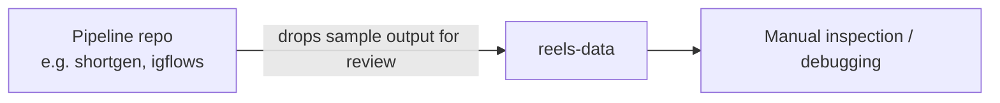

# reels-data

Scratch data store used while testing the `shortgen`/`*flows` short-video pipelines — holds sample rendered clips and ad-hoc test files dropped in during local debugging.

## How it works

This is not an application; it's a working directory checked into git as a convenient drop point. Folders named by content hash (e.g. `cmgza8bfv00270jnyhbkt5ano/`) hold a rendered `.mp4` produced by one of the pipeline repos for inspection, while the `lala*` folders are throwaway scratch files used to sanity-check upload/sync logic.

## Architecture

| Path | Contents |
|---|---|
| `<hash>/` folders | One rendered `.mp4` sample per folder, named by content ID |
| `lala*/` folders | Ad-hoc scratch/test files (not pipeline output) |

No build, dependencies, or entry point — just data.
